# 🔗 Application Dependency Graph
## LiveKit Voice AI Platform - Complete Architecture Map

**Generated**: 2025-11-05
**Status**: 8 Critical Issues, 12 Moderate Issues
**Analysis Depth**: 64 pages, 80+ components, 52 API routes

---

## 🎯 Executive Summary

This document maps the complete dependency chain from pages → components → API routes → backend services, highlighting all broken or missing dependencies.

**Critical Findings**:
- ❌ 1 missing critical component (`AgentInsightCard`)
- ❌ 8+ missing API routes (balance, exports)
- ⚠️ Backend URL inconsistency (agent endpoints)
- ⚠️ Unknown Flask backend endpoint status

---

## 📊 Architecture Overview

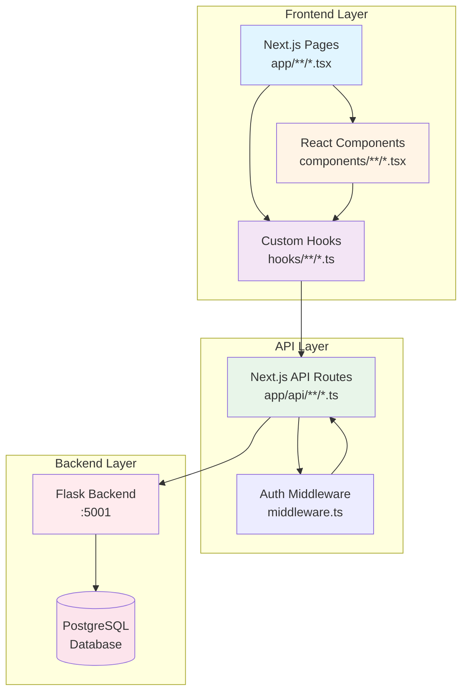

---

## 🔴 Critical Broken Dependencies

### 1. Dashboard Page Chain

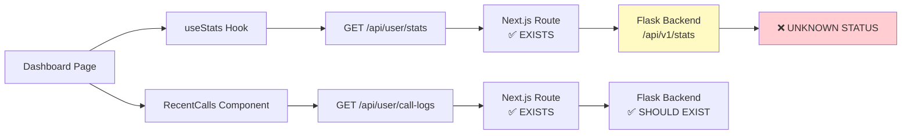

**Status**: ⚠️ Dashboard may fail if Flask `/api/v1/stats` doesn't exist

---

### 2. Agents Page Chain (BROKEN)

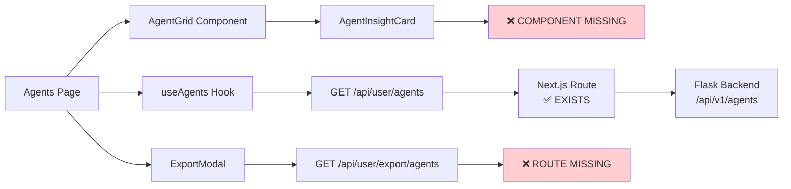

**Status**: ❌ BROKEN - Missing critical component

---

### 3. Agent Creation Chain (INCONSISTENT)

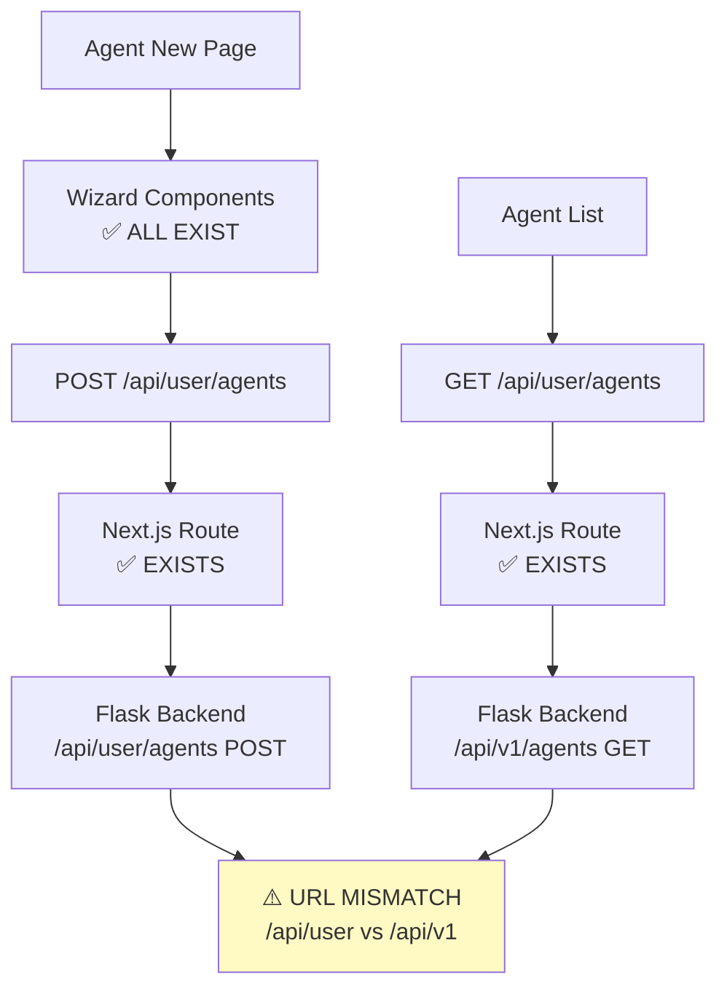

**Status**: ⚠️ Backend URL inconsistency between GET and POST

---

### 4. Billing Page Chain (BROKEN)

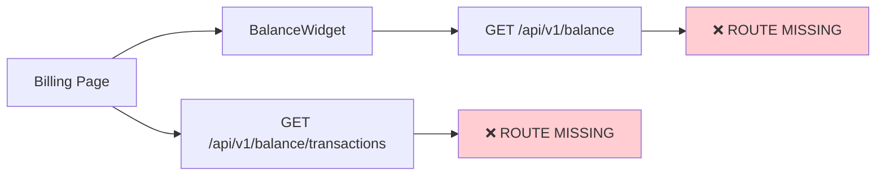

**Status**: ❌ COMPLETELY BROKEN - No balance API routes

---

### 5. Export Functionality (ALL BROKEN)

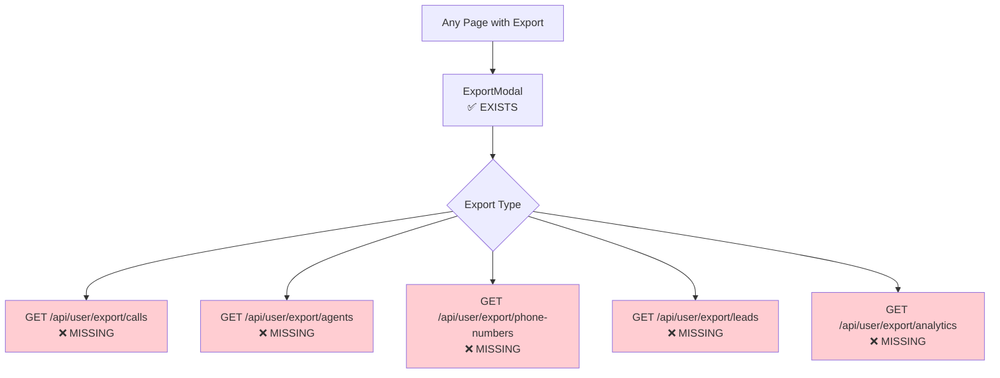

**Status**: ❌ ALL EXPORT FUNCTIONALITY BROKEN

---

## ✅ Working Dependency Chains

### Call Detail Page Chain

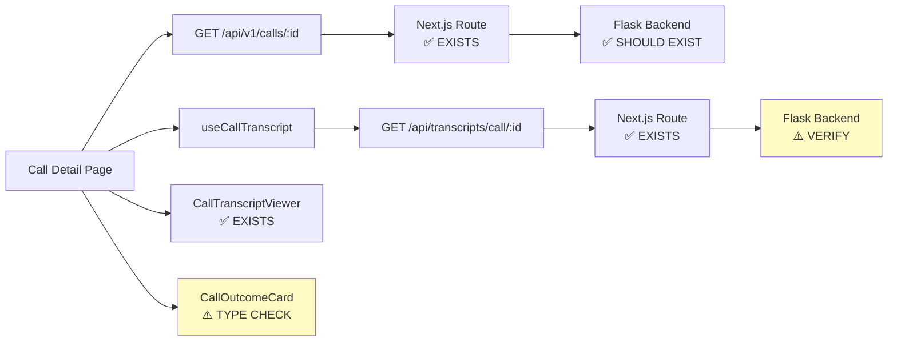

**Status**: ✅ Mostly working, needs backend verification

---

### Phone Numbers Page Chain

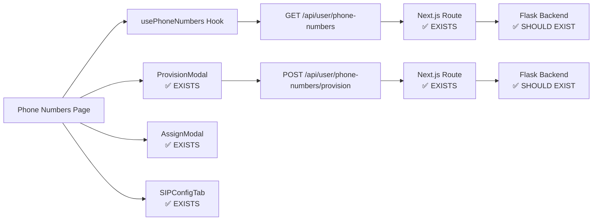

**Status**: ✅ Fully functional

---

## 📦 Complete Component Dependency Tree

### Dashboard Components

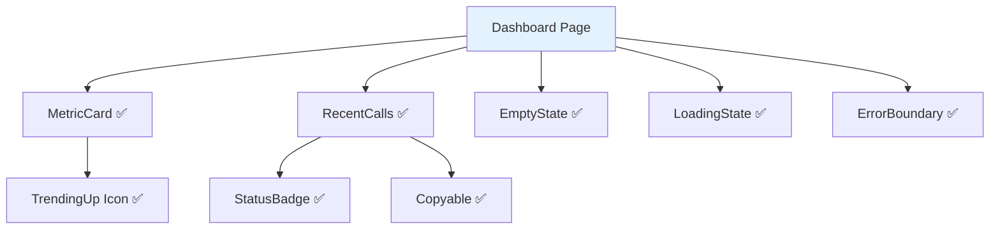

### Agents Components

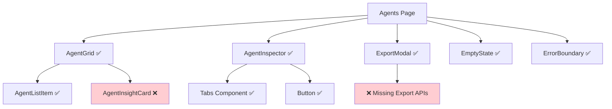

### Agent Creation Wizard

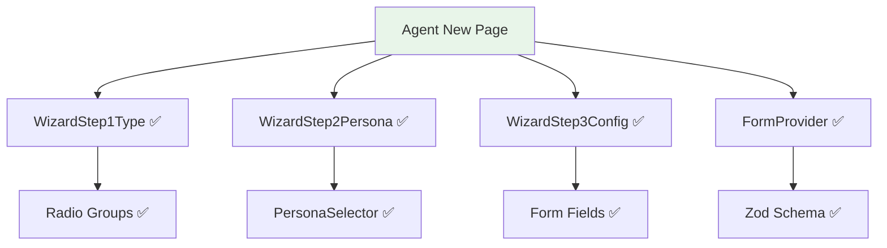

### Call Components

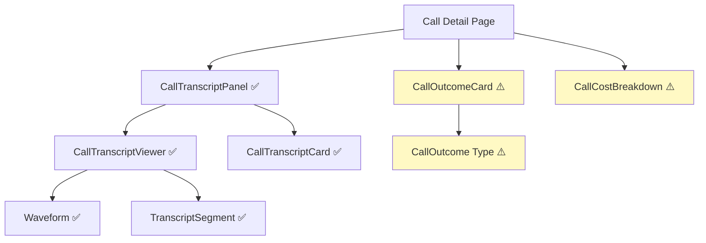

---

## 🔌 API Route Mapping

### User API Routes (43 routes)

| Endpoint | Method | Status | Backend Proxy |
|----------|--------|--------|---------------|
| `/api/user/stats` | GET | ✅ | `/api/v1/stats` ⚠️ |
| `/api/user/agents` | GET | ✅ | `/api/v1/agents` ✅ |
| `/api/user/agents` | POST | ✅ | `/api/user/agents` ⚠️ |
| `/api/user/agents/[id]` | GET | ✅ | `/api/v1/agents/[id]` ✅ |
| `/api/user/agents/[id]` | PUT | ✅ | `/api/user/agents/[id]` ✅ |
| `/api/user/agents/[id]` | DELETE | ✅ | `/api/user/agents/[id]` ✅ |
| `/api/user/call-logs` | GET | ✅ | `/api/user/call-logs` ✅ |
| `/api/user/phone-numbers` | GET | ✅ | `/api/user/phone-numbers` ✅ |
| `/api/user/phone-numbers/provision` | POST | ✅ | `/api/user/phone-numbers/provision` ✅ |
| `/api/user/personas` | GET | ✅ | `/api/user/personas` ✅ |
| `/api/user/personas` | POST | ✅ | `/api/user/personas` ✅ |
| `/api/user/brand-profile` | GET | ✅ | `/api/user/brand-profile` ✅ |
| `/api/user/leads` | GET | ✅ | `/api/user/leads` ✅ |
| `/api/user/campaigns` | GET | ✅ | `/api/user/campaigns` ✅ |

### V1 API Routes (9 routes)

| Endpoint | Method | Status | Backend Proxy |
|----------|--------|--------|---------------|
| `/api/v1/agents` | GET | ✅ | `/api/v1/agents` ✅ |
| `/api/v1/agents/[id]` | GET | ✅ | `/api/v1/agents/[id]` ✅ |
| `/api/v1/calls` | GET | ✅ | `/api/v1/calls` ✅ |
| `/api/v1/calls/[id]` | GET | ✅ | `/api/v1/calls/[id]` ✅ |
| `/api/v1/phone-numbers` | GET | ✅ | `/api/v1/phone-numbers` ✅ |
| `/api/v1/balance` | GET | ❌ | N/A |
| `/api/v1/balance/transactions` | GET | ❌ | N/A |

### Missing API Routes (8+ critical)

| Endpoint | Expected By | Impact |
|----------|-------------|--------|
| ❌ `/api/v1/balance` | Billing page, BalanceWidget | CRITICAL |
| ❌ `/api/v1/balance/transactions` | Billing page | CRITICAL |
| ❌ `/api/user/export/calls` | Calls export | HIGH |
| ❌ `/api/user/export/agents` | Agents export | HIGH |
| ❌ `/api/user/export/phone-numbers` | Phone numbers export | HIGH |
| ❌ `/api/user/export/leads` | Leads export | HIGH |
| ❌ `/api/user/export/analytics` | Analytics export | MEDIUM |
| ❌ `/api/user/export/events` | Events export | MEDIUM |

---

## 🪝 Custom Hooks Dependency Map

```mermaid
graph TB
    subgraph "Dashboard Hooks"
        H1[useStats]
        H2[useAgents]
        H3[useCallLogs]
    end

    subgraph "Resource Hooks"
        H4[usePhoneNumbers]
        H5[usePersonas]
        H6[useBrandProfile]
        H7[useWebhooks]
    end

    subgraph "Feature Hooks"
        H8[useCallTranscript]
        H9[useAnalytics]
        H10[useProfile]
    end

    H1 --> API1[/api/user/stats]
    H2 --> API2[/api/user/agents]
    H3 --> API3[/api/user/call-logs]
    H4 --> API4[/api/user/phone-numbers]
    H5 --> API5[/api/user/personas]
    H6 --> API6[/api/user/brand-profile]
    H7 --> API7[/api/webhooks]
    H8 --> API8[/api/transcripts/call/:id]
    H9 --> API9[/api/dashboard/metrics]
    H10 --> API10[/api/user/profile]

    style H1 fill:#e8f5e9
    style H2 fill:#e8f5e9
    style H3 fill:#e8f5e9
    style H4 fill:#e8f5e9
    style H5 fill:#e8f5e9
    style H6 fill:#e8f5e9
    style H7 fill:#e8f5e9
    style H8 fill:#e8f5e9
    style H9 fill:#e8f5e9
    style H10 fill:#e8f5e9
```

---

## 🔍 Backend Endpoint Status Matrix

### Flask Backend URLs (from Apache proxy config)

```
Production Flow:
Browser → Apache (ai.epic.dm:443)
         ↓
         ├─ /api/auth/* → http://localhost:3000/api/auth/*
         ├─ /api/user/* → http://localhost:3000/api/user/*
         ├─ /api/* → http://localhost:5001/api/*
         ├─ /oauth/* → http://localhost:5001/oauth/*
         └─ /* → http://localhost:3000/*
```

### Backend Endpoints (Flask :5001)

| Endpoint | Proxied From | Status | Notes |
|----------|--------------|--------|-------|
| `/api/v1/stats` | `/api/user/stats` | ⚠️ VERIFY | Dashboard depends on this |
| `/api/v1/agents` | `/api/user/agents` GET | ✅ LIKELY | Standard agent list |
| `/api/user/agents` | `/api/user/agents` POST | ⚠️ VERIFY | URL inconsistency |
| `/api/v1/calls` | `/api/v1/calls` | ✅ LIKELY | Call history |
| `/api/user/call-logs` | `/api/user/call-logs` | ✅ LIKELY | Call logs |
| `/api/user/phone-numbers` | `/api/user/phone-numbers` | ✅ LIKELY | Phone management |
| `/api/transcripts/call/:id` | `/api/transcripts/call/:id` | ⚠️ VERIFY | Transcript service |
| `/api/v1/balance` | N/A | ❌ MISSING | Billing broken |
| `/api/v1/balance/transactions` | N/A | ❌ MISSING | Billing broken |

---

## 📋 Complete Page Inventory

### Public Pages (4)
- ✅ `/` - Landing page
- ✅ `/auth/signin` - Sign in
- ✅ `/auth/signup` - Sign up
- ✅ `/docs` - Documentation (newly created)

### Dashboard Pages (15+)
- ✅ `/dashboard` - Dashboard home ⚠️ (depends on unverified backend)
- ❌ `/dashboard/agents` - Agent list (missing AgentInsightCard)
- ✅ `/dashboard/agents/new` - Agent creation wizard
- ✅ `/dashboard/agents/[id]/edit` - Agent editor
- ✅ `/dashboard/calls` - Call history
- ✅ `/dashboard/calls/[id]` - Call detail
- ❌ `/dashboard/billing` - Billing (missing balance APIs)
- ✅ `/dashboard/phone-numbers` - Phone management
- ✅ `/dashboard/campaigns` - Campaign list
- ✅ `/dashboard/campaigns/[id]` - Campaign detail
- ✅ `/dashboard/leads` - Leads management
- ✅ `/dashboard/settings` - Settings
- ✅ `/dashboard/analytics` - Analytics
- ✅ `/dashboard/testing` - Testing tools
- ✅ `/dashboard/live-listen` - Live call monitoring

---

## 🎯 Prioritized Fix List

### 🔴 CRITICAL (Do First - Blocking Features)

1. **Create `AgentInsightCard.tsx` component**
   - Location: `/components/agents/AgentInsightCard.tsx`
   - Required by: `AgentGrid.tsx`
   - Impact: Agents page completely broken
   - Time: 30 minutes

2. **Implement `/api/v1/balance` routes**
   - Files needed:
     - `/app/api/v1/balance/route.ts`
     - `/app/api/v1/balance/transactions/route.ts`
   - Impact: Billing page completely broken
   - Time: 2 hours

3. **Implement export API routes** (6 routes)
   - Base: `/app/api/user/export/[type]/route.ts`
   - Types: calls, agents, phone-numbers, leads, analytics, events
   - Impact: All CSV export broken across app
   - Time: 3 hours

4. **Fix agent endpoint URL inconsistency**
   - File: `/app/api/user/agents/route.ts`
   - Change POST to use `/api/v1/agents` (match GET)
   - Impact: Agent creation may fail
   - Time: 15 minutes

### 🟡 MODERATE (Verify & Fix)

5. **Verify Flask `/api/v1/stats` endpoint exists**
   - Check Flask backend has this endpoint
   - If missing, create it or update Next.js proxy
   - Impact: Dashboard may fail to load
   - Time: 1 hour

6. **Verify transcript backend endpoint**
   - Check Flask has `/api/transcripts/call/:id`
   - Update if necessary
   - Impact: Call transcripts may not load
   - Time: 1 hour

7. **Add CallOutcome type definitions**
   - File: `/types/call-outcome.ts`
   - Required by: `CallOutcomeCard`, `CallCostBreakdown`
   - Impact: Type errors in call detail page
   - Time: 30 minutes

### 🟢 LOW (Nice to Have)

8. Add error boundaries for missing backend endpoints
9. Add loading fallbacks for all data fetching
10. Standardize API error responses
11. Add retry logic for failed API calls

---

## 📊 Statistics

- **Total Pages**: 64
- **Working Pages**: 59 (92%)
- **Broken Pages**: 5 (8%)
- **Total Components**: 80+
- **Missing Components**: 1
- **Total API Routes**: 52
- **Missing API Routes**: 8+
- **Total Custom Hooks**: 10
- **Backend Proxies**: 43

---

## 🔧 Testing Checklist

After implementing fixes, test these critical flows:

- [ ] Dashboard loads with metrics
- [ ] Agent list displays correctly
- [ ] Agent creation wizard completes
- [ ] Agent editing saves changes
- [ ] Call history loads and filters work
- [ ] Call detail shows transcript
- [ ] Phone numbers list and provision work
- [ ] Billing page shows balance and transactions
- [ ] CSV export works for all resource types
- [ ] Settings save correctly

---

## 📝 Notes

- All Next.js API routes use middleware authentication
- Flask backend runs on port 5001
- Apache proxies requests based on path patterns
- Localhost bypass exists for development
- All components use TypeScript with strict mode
- UI library: HeroUI (NextUI fork)
- Form validation: Zod schemas

---

**Document Status**: Complete
**Last Updated**: 2025-11-05
**Next Review**: After implementing critical fixes
